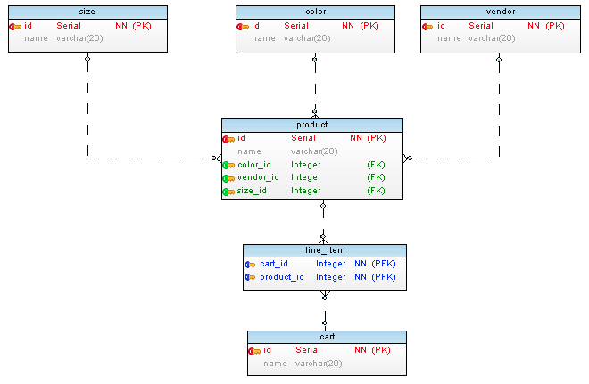

<a name="M2MRelation"></a>
## M2MRelation
**Kind**: global class  

* [M2MRelation](#M2MRelation)
    * [new M2MRelation(args)](#new_M2MRelation_new)
    * [.type](#M2MRelation+type) : <code>relationType</code>
    * [.sourceTable](#M2MRelation+sourceTable) : <code>Table</code>
    * [.joinTable](#M2MRelation+joinTable) : <code>Table</code>
    * [.targetTable](#M2MRelation+targetTable) : <code>Table</code>
    * [.sourceConstraint](#M2MRelation+sourceConstraint) : <code>Table</code>
    * [.targetConstraint](#M2MRelation+targetConstraint) : <code>Table</code>

<a name="new_M2MRelation_new"></a>
### new M2MRelation(args)
Class which represent a many to many relationship which resembles `belongsToMany` or `hasManyThrough` relations in ORMs (Object Relational Mappers).
Provides attributes and methods for details of the relationship.

Actually there isn't such a thing called **many to many relationship** or **through constraint** in the database engine.
They are concepts to describe records which may be related more than one record on both sides.
For example an invoice may contain more than product and a product may related to more than one invoice.
Those relationships are solved a so called many to many **join table**.

Since those relations are not present in database engine, they are extracted by estimation/interpretation.
Many non-join tables in a database could have more than one foreign key constraints,
and they may not meant to be join tables, but they still appear to have through relationships.

<span id="exampleSchema"></span>Below is a database schema as an example:
```
size -------------------
id (PK)                |  ---------------------------< line_item >------------ cart
name                   |  |                            product_id (PFK)        id (PK)
                       |  |                            cart_id    (PFK)        name
                       ^  |
color -------------< product >------------- vendor
id (PK)              id        (PK)         id (PK)
name                 name                   name
                     color_id  (FK)
                     size_id   (FK)
                     vendor_id (FK)

```
Below is the same schema as image:


Some definitions used in descriptions for [M2MRelation](#M2MRelation).
* ** Source Table: ** Table which this relationship belongs to.
* ** Join Table: ** Table that contains common fields from two or more other tables.
* ** Target Table: ** Table that is related to base table through a join table.
<br><br>
Product table has 3 foreign key constraints. Product table is not meant to be a many to many join table.
However product could have been join table for `size & vendor`, `color & vendor` and `size & color`. As a result size,
color and vendor tables would have many to many relationships.


| Param | Type | Description |
| --- | --- | --- |
| args | <code>Object</code> | Attributes of the [M2MRelation](#M2MRelation) instance to be created. |
| args.sourceTable | <code>Table</code> | Source [Table](Table) which this relation belongs to. |
| args.joinTable | <code>Table</code> | Join [Table](Table) of this relationship. |
| args.targetTable | <code>Table</code> | Target [Table](Table) which this relation is referring to through a join table. |
| args.sourceConstraint | <code>Constraint</code> | Foreign key constraint between source table and join table. |
| args.targetConstraint | <code>Constraint</code> | Foreign key constraint between join table and target table. |

**Example**  
```js
// Example tables have single primary key and and examples first relation. So zero index ([0]) is used. Use all array elements if necessary.
// product ----< line_item >---- cart
// (source)        (join)       (target)

let relation             = product.m2mRelations[0];              // RELATION:    product ---< line_item >--- cart
let sourceConstraint     = relation.sourceConstraint;            // CONSTRAINT:           ^-- product_has_carts
let targetConstraint     = relation.targetConstraint;            // CONSTRAINT:       cart_has_products --^
let sourceTable          = relation.sourceTable;                 // TABLE:       product
let targetTable          = relation.targetTable;                 // TABLE:       cart
let sourceJoinFKColumn   = relation.sourceConstraint.columns[0]; // COLUMN:      product_id  (from line_item table)
let targetJoinFKColumn   = relation.targetConstraint.columns[0]; // COLUMN:      cart_id     (from line_item table)
let sourcePKColumn       = relation.sourceTable.primaryKeys[0];  // COLUMN:      id          (from product table)
let targetPKColumn       = relation.targetTable.primaryKeys[0];  // COLUMN:      id          (from cart table)
```
<a name="M2MRelation+type"></a>
### m2MRelation.type : <code>relationType</code>
Type of relation which is `MANY TO MANY`.

**Kind**: instance property of <code>[M2MRelation](#M2MRelation)</code>  
**Read only**: true  
<a name="M2MRelation+sourceTable"></a>
### m2MRelation.sourceTable : <code>Table</code>
[Table](Table) which this relation belongs to.

**Kind**: instance property of <code>[M2MRelation](#M2MRelation)</code>  
**Read only**: true  
**Example**  
```js
let relation = product.M2MRelationRelations[0];  // RELATION:    product ---< line_item >--- cart
let source   = relation.sourceTable;             // TABLE:       product
```
<a name="M2MRelation+joinTable"></a>
### m2MRelation.joinTable : <code>Table</code>
Join [Table](Table) of this relationship. This table contains foreign key columns referring both
[sourceTable](#M2MRelation+sourceTable) and [targetTable](#M2MRelation+targetTable).

**Kind**: instance property of <code>[M2MRelation](#M2MRelation)</code>  
**Read only**: true  
**Example**  
```js
let relation  = product.M2MRelationRelations[0]; // RELATION:    product ---< line_item >--- cart
let joinTable = relation.joinTable;              // TABLE:       line_item
```
<a name="M2MRelation+targetTable"></a>
### m2MRelation.targetTable : <code>Table</code>
[Table](Table) which this relation is referring to (Through a join table).

**Kind**: instance property of <code>[M2MRelation](#M2MRelation)</code>  
**Read only**: true  
**Example**  
```js
let relation = product.M2MRelationRelations[0];  // RELATION:    product ---< line_item >--- cart
let target   = relation.targetTable;             // TABLE:       cart
```
<a name="M2MRelation+sourceConstraint"></a>
### m2MRelation.sourceConstraint : <code>Table</code>
Foreign key [constraint](Constraint) between [source table](#M2MRelation+sourceTable) and [join table](#M2MRelation+joinTable).

**Kind**: instance property of <code>[M2MRelation](#M2MRelation)</code>  
**Read only**: true  
**Example**  
```js
let relation             = product.M2MRelationRelations[0];      // RELATION:    product ---< line_item >--- cart
let sourceConstraint     = relation.sourceConstraint;            // CONSTRAINT:           ^-- product_has_carts
let sourceJoinFKColumn   = relation.sourceConstraint.columns[0]; // COLUMN:      product_id (from line_item table)
```
<a name="M2MRelation+targetConstraint"></a>
### m2MRelation.targetConstraint : <code>Table</code>
Foreign key [constraint](Constraint) between [join table](#M2MRelation+joinTable) and [target table](#M2MRelation+targetTable).

**Kind**: instance property of <code>[M2MRelation](#M2MRelation)</code>  
**Read only**: true  
**Example**  
```js
let relation             = product.M2MRelationRelations[0];      // RELATION:    product ---< line_item >--- cart
let targetConstraint     = relation.targetConstraint;            // CONSTRAINT:       cart_has_products --^
let targetJoinFKColumn   = relation.targetConstraint.columns[0]; // COLUMN:      cart_id (from line_item table)
```
